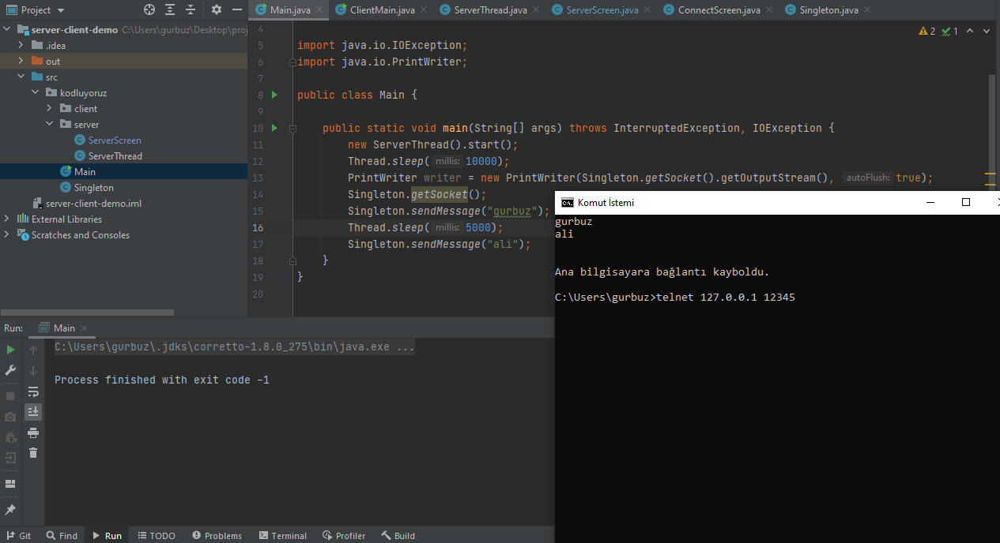

[src/kodluyoruz/client/ConnectScreen.java](Client için bağlantı ekranı) 

[src/kodluyoruz/client/ServerScreen](Server için hareket yön tuşları ile hareket ettirilen ekran) 

 

[src/kodluyoruz/Main](Server tarafından gönderilen mesajı Telnet ile server a bağlanıp alınması) 

  ## Yapılacaklar

- Server a birden fazla bağlantı
- Client thread ve connection ekranında join butonuna bağlantı
- Kare hareketlerinin server tarafından alınıp katılımcılara gönderilmesi ve senkronizasyon

